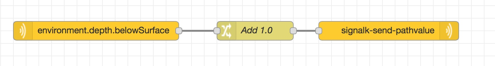
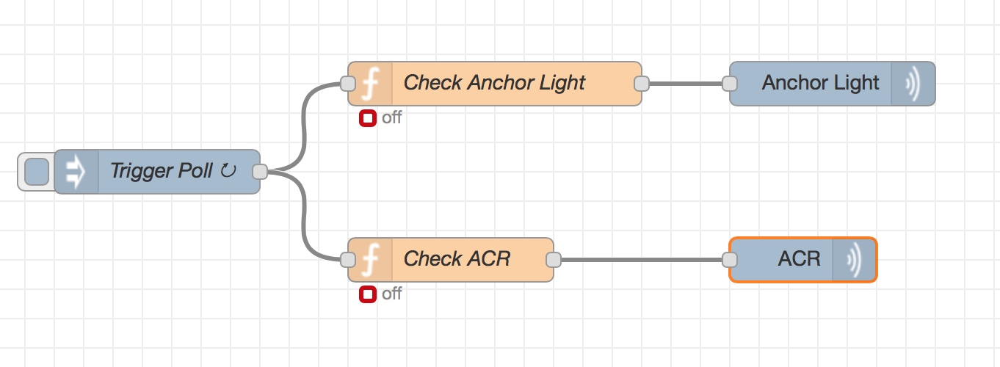
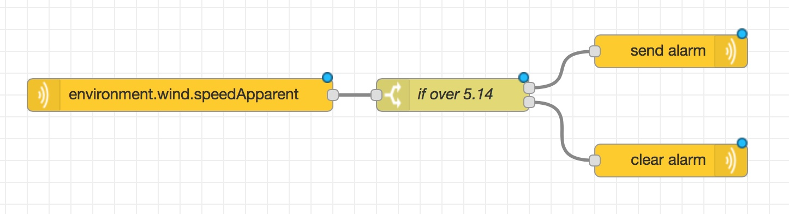
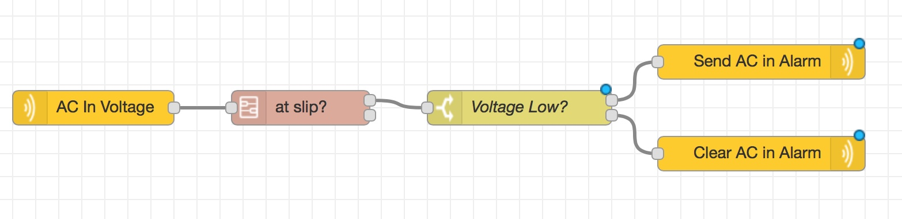

# node-red-embedded
Node red nodes for use with the signalk-node-red plugin

See the examples folder for some sample usage.

# Examples

## Send an adjusted depth value


## Switch relays based on complex conditions (example turns on/off the anchor light and ACR automatically)


## Send an alarm when wind speed is high


## Send an alarm when the AC input voltage is low and the boat is in its slip


# Available Nodes

## signalk-on-delta

Input that sends messages for every delta the server receives

## signalk-subscribe

Input that sends messages for every delta from the given path

## signalk-flatten-delta

Function that flatten deltas from signalk-on-delta.

The output payload with be have path, value, source and context:

```
{
  "path":"navigation.speedOverGround",
  "value":2.45,
  "source":{"label":"actisense","type":"NMEA2000","pgn":129026,"src":"3",
  "context": "vessels.self"
}
```

## signalk-send-pathvalue

Output that sends a delta through the server. Input should be path and value

```
{
  "path":"navigation.speedOverGround",
  "value":20.45
}
```

## signalk-notification

Input that sends a message when a notification is received. Configuration allows messages for a specific notification or any notification. The notification state can also be specified. Payload will be the notification path and value.

```
{
  "path: "notifications.anchorAlarm",
  "value" : {
    "state" : "emergency",
    "method" : [
      "visual",
      "sound"
    ],
    "timestamp" : "2018-06-15T15:01:55.007Z",
    "message" : "Anchor Alarm - Emergency"
  }
}
```

## signalk-send-delta

Output that sends a delta to the server. Input should be a fully formed SignalK delta

## signalk-send-put

Output that send a SignalK put request via `app.putSelfPath`. Input should be the value to put.

## signalk-send-notification

Output that sends a SignalK notification

If the input payload is an object, then it will use the keys path, state, method, and message. Example below. Otherwise  it will use the configured values.

To specify all the info, send:
```
{payload: {
  "path":"notifications.testNotification",
  "state":"alarm",
  "method":["visual","sound"],
  "message":"this is a notification message"
}}
```

Or to specify some of the info, send:
```
{payload: {
  "state":"normal",
}}
```

## signalk-send-nmea2000

Output that sends out NMEA 2000 messages. Input payload can be canboat json format or a raw Actisense formatted string

## signalk-send-nmea0183

Output that sends out NMEA 0183 messages. Input payload can be an 0183 formatted string.
